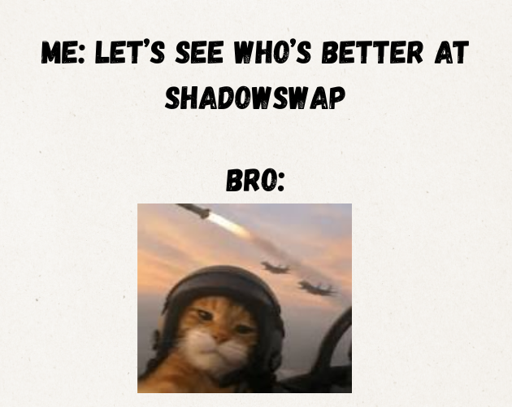

# Shadow Swap
You play, and find out 😉



## Where can I play?
You can either directly visit the [itch.io](elipseday.itch.io/shadowswap) listing, or visit the [landing page](https://shadowswapper.vercel.app)

## Tech Stack
This game was developed in Godot

## Prerequisites
```
Download Godot
```


## Forking
```
git clone https://github.com/harshilarora250/shadow-swap/
cd shadow-swap
cd shadow-swap--game
#you can now open this folder within godot to access the game, and make changes of your own
```

## AI Usage
AI was mainly used for bug fixes, wherever else I tried to use AI, it sucked.

## Contribution
This project was developed by [Harshil Arora](https://elipseday-nine.vercel.app/#contact)